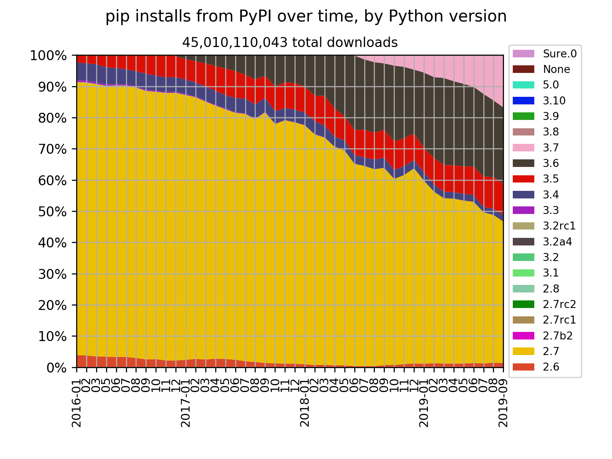
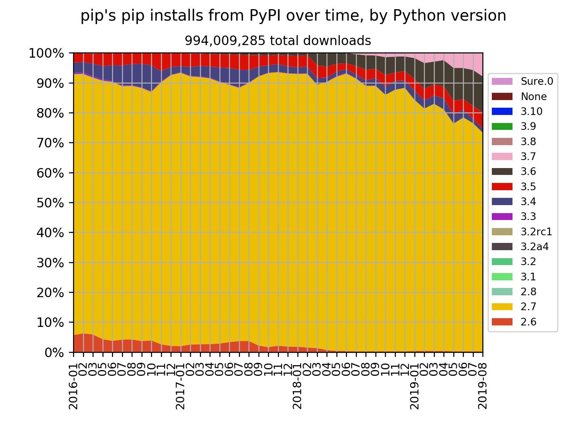
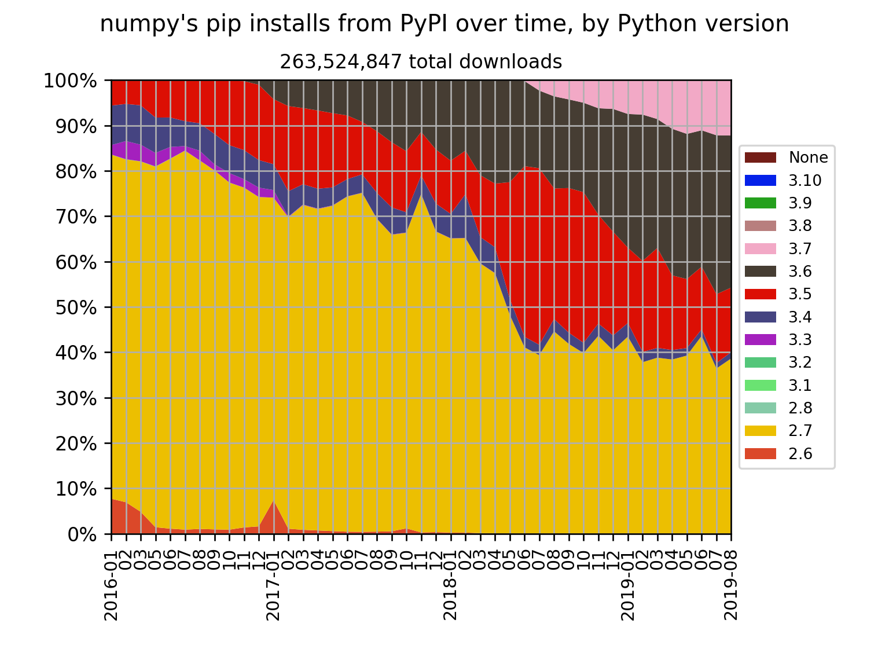
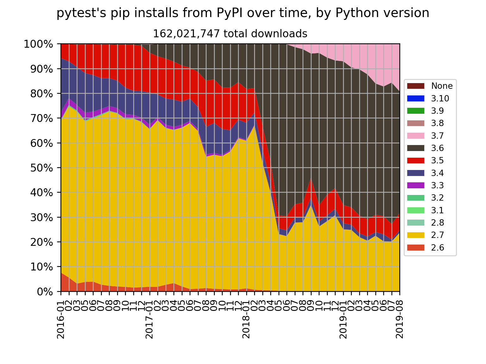
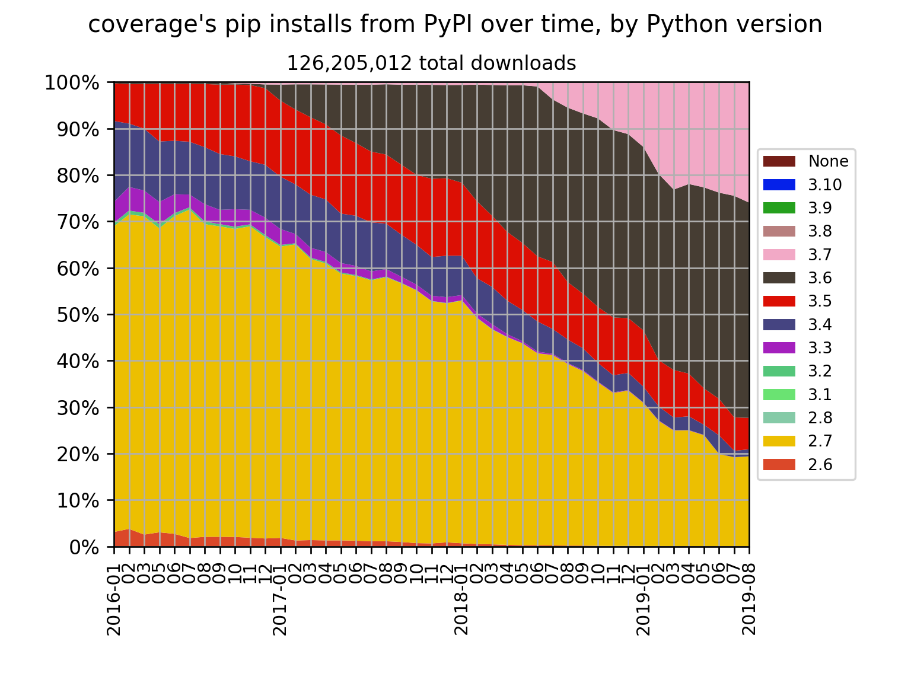
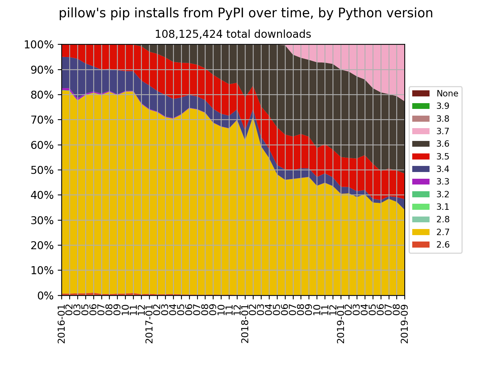
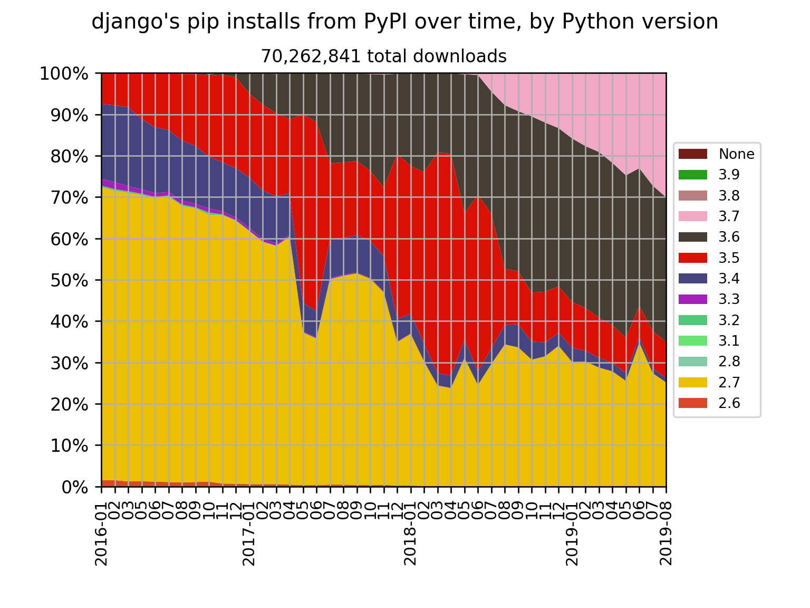
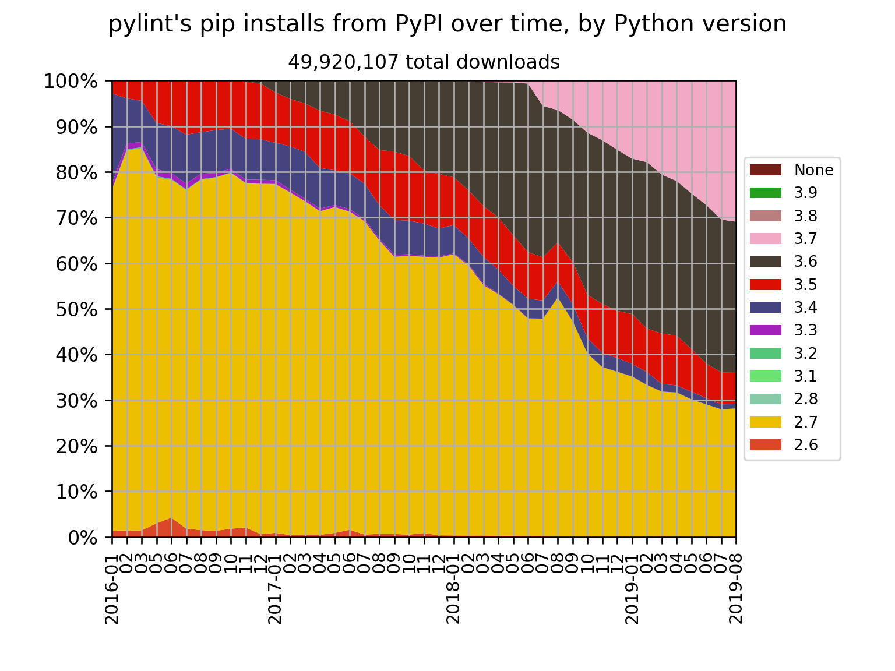
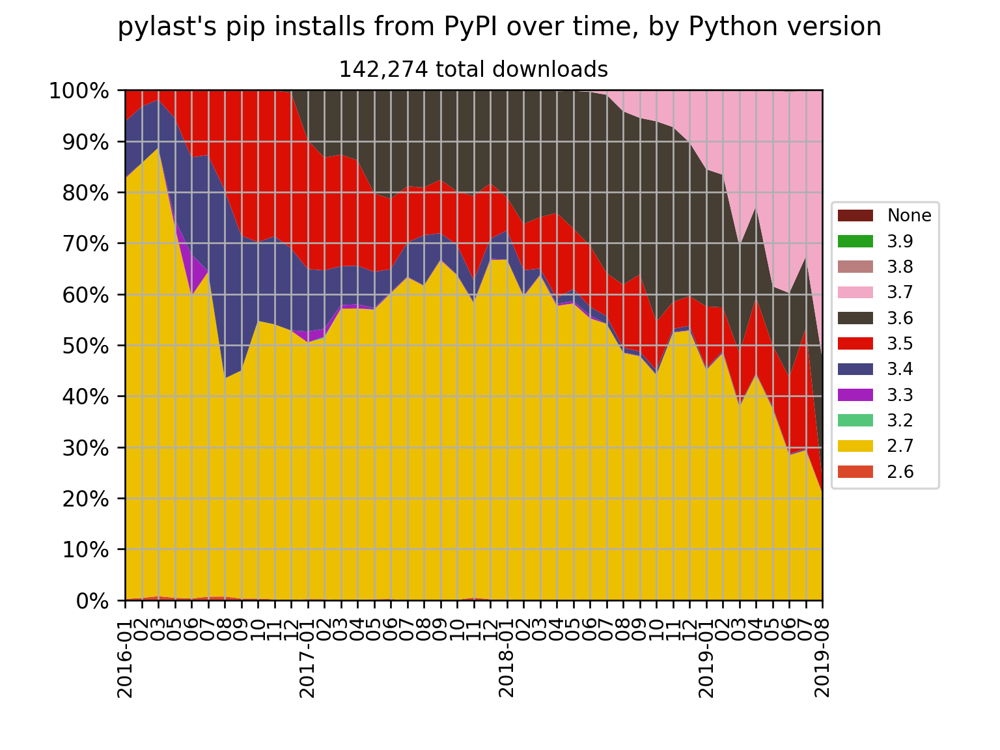

# pypi-tools

Command-line Python scripts to do things with the
[Python Package Index (PyPI)](https://pypi.org/).

## pypi-trends.py

pypi-trends.py is a wrapper around [pypinfo](https://github.com/ofek/pypinfo)
to fetch all monthly downloads from the PyPI database on Google BigQuery and
save them as JSON files.

For the examples below, data was downloaded over a few days as getting all
months uses up a lot of free BigQuery quota.

## jsons2csv.py

jsons2csv.py converts the JSON files into a single CSV file for chart-wrangling
in a spreadsheet, and can generate a chart using Matplotlib.

## Examples

Here the pip installs for all packages from the Python Package Index (PyPI),
from January 2016 onwards:

### [pip](https://github.com/pypa/pip)

The package installer

### [NumPy](https://github.com/numpy/numpy)

Scientific computing library

### [pytest](https://github.com/pytest-dev/pytest)

Testing framework

### [Coverage.py](https://github.com/nedbat/coveragepy)

Code coverage testing

### [Pillow](https://github.com/python-pillow/Pillow)

Imaging library

### [Django](https://github.com/python-pillow/Pillow)

Web framework

### [Matplotlib](https://github.com/matplotlib/matplotlib)

2D plotting library

### [Pylint](https://github.com/PyCQA/pylint/)

Linter

### [pylast](https://github.com/pylast/pylast)

Interface to Last.fm

## See also

* [Python version share over time](https://medium.com/@hugovk/python-version-share-over-time-cf4498822650)
